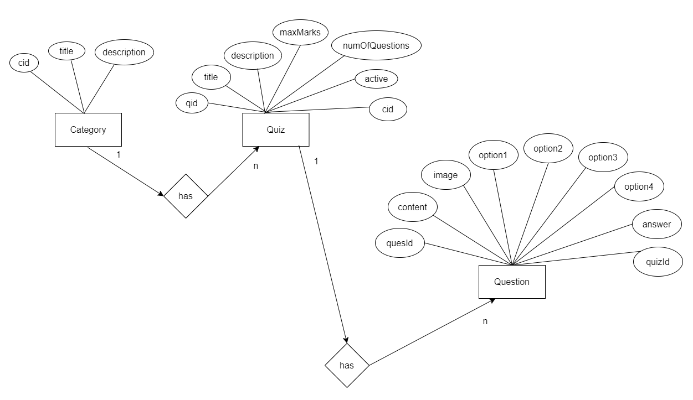

# ExamPortal

### It is Springboot Application with Angular Frontend
## It is an Online Exam Application. 
- It is Backend Part, for Fronted Part see url: https://github.com/swapnilbamble1438/ExamPortalAngularGUI

  ### Application Features
 - Admin can create  Quizzes with Categories,containing Questions based on their Specific Quiz Type.
 - Admin can Edit,Delete, Update any Category,Quiz,Question.
 - Admin can Activate/Deactivate Specific Quiz.  
 - User(Normal User) can give Exams.
 - User(Normal User) can Check their Results.
              

### Technology used in this Project: 
- i) Angular : designing page layout (find it here "ExamPortalAngularGui" Repository). 
- ii) Java : all the logic has been written in java. 
- iii) MySQL: MySQL database has been used as database.
- iv) SpringSecurity: SpringSecurity has been used for authentication.
- v) Hibernate: Hibernate ORM is used.

### Software And Tools Required:
- Java JDK 8+ 
- Eclipse EE or Spring Tool Suite
- MySQL

### Steps To Import And Run The Project in Eclipse EE
- In Eclipse or Spring Tool Suite
- Click on File
- Select Import
- Select Projects from Git(with smart import) -> Next
- Select Clone URI -> Next
- In URI paste this url: https://github.com/swapnilbamble1438/ExamPortal.git
  -> Next
-  Now in Local Destination

-  proceed -> Next

            Now only select ExamPortal\ExamPortal
            -> Finish
   
-  If everything goes right Project will get successfully imported
-  Now wait for few seconds for getting things properly loaded

-  Now open Project > src/main/resources > open application.properties file,
   inside this file look for
   
   spring.datasource.url=jdbc:mysql://localhost:3306/examportal?serverTimezone=UTC

   here "examportal" is the name of the database.
   
     so

   ## create database name "examportal" in MySQL.

    or

   (you can also create the database with different name in MySQL. but the created database
   name in MySQL should match the database name in url in application.properties file.
   so according to created database in MySQL set the database name in url in 
   application.properties 
   file.
   - Now save the changes.)
   - Then install its fron-end Code from "ExamPortalAngularGui" Repository.
  - And try to run it.

### Project Structure:

==================================================================================================================================================================

==================================================================================================================================================================

### Screenshot of Api's
:

### Project Creator: Swapnil Bamble

